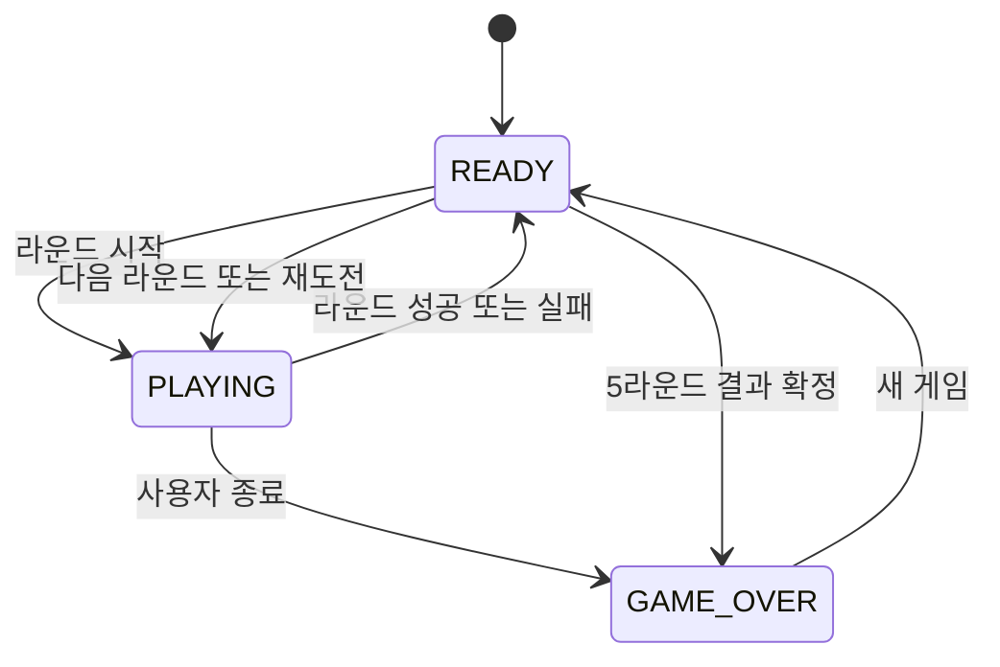

# 괴물 사진사: 미지의 숲 — 개발 설계서

## 문서 목적

이 문서는 `game-plan.md`의 기획을 HTML, CSS, 순수 JavaScript로 구현하기 위한 개발 설계서다. 실제 코드를 작성하기 전에 파일 구성, 화면 구조, 게임 상태, 데이터, 입력 처리와 완료 조건을 미리 정하는 것이 목적이다.

개발 경험이 없는 사람도 이해할 수 있도록 각 기능의 역할과 구현 이유를 함께 설명한다.

---

## 1. 개발 방식과 제한 조건

### 1.1 개발 방식

| 항목 | 설계 내용 |
|---|---|
| 실행 방식 | 웹 브라우저에서 `index.html`을 열어 실행하는 정적 웹 게임 |
| 사용 기술 | HTML, CSS, 순수 JavaScript |
| 기준 해상도 | 1280×720, 16:9 비율 |
| 주요 입력 | 마우스 이동, 왼쪽 클릭, 우클릭 유지, 휠, `R`, `ESC` |
| 화면 그리기 | HTML 요소와 CSS 변형을 기본으로 사용하고, 촬영 사진 저장에만 Canvas 사용 |
| 데이터 저장 | 브라우저의 `localStorage` 사용 |
| 배포 | GitHub Pages |

`localStorage`는 서버 없이 브라우저 내부에 간단한 기록을 저장하는 기능이다. 최고 점수와 설정값처럼 작은 데이터에만 사용한다.

### 1.2 제한 조건

- React, Vue, Phaser, jQuery 같은 외부 라이브러리를 사용하지 않는다.
- 별도의 프로그램 설치가 필요한 빌드 도구를 사용하지 않는다.
- 서버, 데이터베이스, 회원가입, 로그인, 결제 기능을 사용하지 않는다.
- 모든 파일은 상대 경로를 사용해 GitHub Pages에서도 실행되게 한다.
- 실제 게임 진행에 인터넷 연결이 필요하지 않게 한다.
- 잔혹하거나 사실적인 공포 표현은 사용하지 않는다.
- 24시간 안에 완성하기 위해 5라운드, 괴물 5종, 상점 장비 4종으로 범위를 제한한다.

### 1.3 HTML 요소와 Canvas의 역할 분리

| 방식 | 담당 요소 | 선택 이유 |
|---|---|---|
| HTML/CSS | 배경, 괴물, 카메라, UI, 버튼, 앨범, 상점 | 위치와 애니메이션을 쉽게 확인하고 수정할 수 있음 |
| Canvas | 셔터 순간의 촬영 영역을 이미지로 저장 | 현재 화면 일부를 사진처럼 잘라 저장하기 적합함 |

게임 전체를 Canvas로 만들지 않는다. 초보자가 요소를 찾고 수정하기 쉬운 HTML/CSS 구조를 우선한다.

### 1.4 GitHub Pages 실행 규칙

- 첫 화면 파일 이름은 반드시 `index.html`로 한다.
- `/assets/...`처럼 사이트 루트에서 시작하는 경로 대신 `./assets/...` 상대 경로를 사용한다.
- 파일명에는 공백, 한글, 대문자를 사용하지 않는 것을 권장한다.
- 파일명은 소문자와 하이픈으로 통일한다.
- 파일 이름의 대소문자를 코드와 실제 파일에서 정확히 일치시킨다.
- 로컬 파일 보안 제한을 피하기 위해 개발 중에는 간단한 로컬 서버로 테스트할 수 있지만, 배포 결과에는 서버 기능이 포함되지 않는다.

---

## 2. 프로젝트 파일 및 폴더 구조

```text
monster-photographer/
├── index.html
├── README.md
├── game-plan.md
├── game-design.md
├── css/
│   ├── reset.css
│   ├── style.css
│   ├── game.css
│   └── animations.css
├── js/
│   ├── main.js
│   ├── config.js
│   ├── state.js
│   ├── ui.js
│   ├── input.js
│   ├── camera.js
│   ├── monsters.js
│   ├── capture.js
│   ├── rounds.js
│   ├── album.js
│   ├── shop.js
│   ├── audio.js
│   └── storage.js
└── assets/
    ├── images/
    │   ├── backgrounds/
    │   │   └── moonlit-forest.png
    │   ├── monsters/
    │   │   ├── false-one-eye.png
    │   │   ├── mist-wraith.png
    │   │   ├── moonlight-hare.png
    │   │   ├── mossantler.png
    │   │   └── shadow-wolf.png
    │   ├── camera/
    │   │   ├── camera-hand.png
    │   │   └── camera-aim.png
    │   ├── foregrounds/
    │   │   ├── branches.png
    │   │   └── fog.png
    │   ├── effects/
    │   │   └── vanish-particles.png
    │   └── ui/
    │       ├── capture-frame.png
    │       ├── coin.png
    │       ├── film.png
    │       ├── album-frame.png
    │       └── equipment/
    │           ├── film-upgrade.png
    │           ├── reload-upgrade.png
    │           ├── precision-lens.png
    │           └── night-filter.png
    └── sounds/
        ├── bgm.mp3
        ├── shutter.mp3
        ├── reload.mp3
        ├── capture-success.mp3
        ├── perfect-capture.mp3
        ├── capture-fail.mp3
        ├── monster-appear.mp3
        ├── monster-vanish.mp3
        ├── coin.mp3
        ├── time-warning.mp3
        ├── round-clear.mp3
        └── round-fail.mp3
```

### 2.1 JavaScript 파일 역할

| 파일 | 역할 | 쉬운 설명 |
|---|---|---|
| `main.js` | 게임 시작과 전체 기능 연결 | 여러 기능을 불러와 게임을 시작시키는 중심 파일 |
| `config.js` | 라운드, 괴물, 장비 수치 | 시간을 바꾸려면 이 파일만 수정하도록 숫자를 모아둔 파일 |
| `state.js` | 현재 게임 상태와 진행 데이터 | 게임이 시작 전인지, 진행 중인지, 종료됐는지 기억함 |
| `ui.js` | 화면과 버튼 갱신 | 점수와 남은 필름을 실제 화면에 표시함 |
| `input.js` | 마우스와 키보드 입력 | 플레이어가 누른 버튼을 알맞은 기능으로 전달함 |
| `camera.js` | 카메라 이동, 확대, 줌 | 카메라와 배경 움직임을 담당함 |
| `monsters.js` | 괴물 생성과 행동 | 괴물을 고르고 등장·이동·숨기기를 처리함 |
| `capture.js` | 눈 판정과 촬영 결과 | 두 눈이 프레임 안에 들어왔는지 확인함 |
| `rounds.js` | 타이머와 라운드 진행 | 라운드 시작, 성공, 실패를 관리함 |
| `album.js` | 촬영 사진과 앨범 | 촬영 결과를 모아 라운드 종료 후 보여줌 |
| `shop.js` | 장비 구매와 효과 | 코인을 확인하고 장비 단계를 올림 |
| `audio.js` | 배경음과 효과음 | 소리를 재생하고 음소거 설정을 관리함 |
| `storage.js` | 브라우저 기록 저장 | 최고 기록과 설정을 저장하고 불러옴 |

처음부터 모든 파일을 만들기 어렵다면 `main.js`, `config.js`, `style.css`로 시작한 뒤 기능이 완성될 때마다 파일을 나눌 수 있다.

### 2.2 이미지 리소스 저장 위치와 용도

GPT-image-2.5로 생성한 이미지 파일은 아래 경로와 파일명을 기준으로 사용한다. 현재 이미지 리소스는 PNG로 통일하며, 코드에서 사용하는 경로도 이 표와 정확히 일치해야 한다.

| 분류 | 파일 경로 | 투명 여부 | 게임 내 용도 |
|---|---|---|---|
| 배경 | `assets/images/backgrounds/moonlit-forest.png` | 불투명 | 이동하고 확대할 수 있는 큰 달빛 숲 배경 |
| 괴물 | `assets/images/monsters/false-one-eye.png` | 투명 | 두눈 흉내쟁이 표시 |
| 괴물 | `assets/images/monsters/mist-wraith.png` | 투명 | 안개 유령 표시 |
| 괴물 | `assets/images/monsters/moonlight-hare.png` | 투명 | 달빛토끼 표시 |
| 괴물 | `assets/images/monsters/mossantler.png` | 투명 | 이끼뿔 표시 |
| 괴물 | `assets/images/monsters/shadow-wolf.png` | 투명 | 그림자 늑대 표시 |
| 전경 | `assets/images/foregrounds/branches.png` | 투명 | 괴물의 몸이나 한쪽 눈을 가리는 나무·나뭇잎 레이어 |
| 전경 | `assets/images/foregrounds/fog.png` | 매우 투명 | 숲의 깊이를 표현하고 괴물을 약하게 가리는 움직이는 안개 |
| 카메라 | `assets/images/camera/camera-hand.png` | 투명 | 마우스를 따라 움직이는 일반 상태의 카메라와 손 |
| 카메라 | `assets/images/camera/camera-aim.png` | 투명 | 우클릭 유지 중 화면 중앙에 표시할 확대 조준 카메라 |
| 효과 | `assets/images/effects/vanish-particles.png` | 투명 | 촬영 성공 시 사용하는 사실적인 노란색 빛 입자 소멸 효과 |
| UI | `assets/images/ui/capture-frame.png` | 투명 | 일반 촬영 영역과 중앙 완벽 판정 영역 표시 |
| UI | `assets/images/ui/film.png` | 투명 | 남은 필름 수 표시 |
| UI | `assets/images/ui/coin.png` | 투명 | 획득 코인과 상점 가격 표시 |
| UI | `assets/images/ui/album-frame.png` | 투명 | 라운드 결과의 사진 카드 테두리 |
| 장비 | `assets/images/ui/equipment/film-upgrade.png` | 투명 | 필름 확장팩 상점 아이콘 |
| 장비 | `assets/images/ui/equipment/reload-upgrade.png` | 투명 | 고속 필름 교환기 상점 아이콘 |
| 장비 | `assets/images/ui/equipment/precision-lens.png` | 투명 | 정밀 렌즈 상점 아이콘 |
| 장비 | `assets/images/ui/equipment/night-filter.png` | 투명 | 야간 필터 상점 아이콘 |

#### 이미지 적용 규칙

- `moonlit-forest.png`만 화면 전체를 채우는 불투명 이미지로 사용한다.
- 나머지 이미지는 모두 투명 배경 PNG 상태를 유지한다.
- `fog.png`에는 CSS로 추가 투명도를 적용할 수 있으며 괴물의 눈을 완전히 가리지 않게 한다.
- `vanish-particles.png`는 판타지 마법진처럼 표현하지 않고 실제 빛가루에 가까운 노란색 입자로 표시한다.
- 장비 아이콘은 하나의 `equipment-icons.png`로 합치지 않고 네 개 파일로 각각 사용한다.
- 기존 문서의 `coin.svg`, `film.svg`, `equipment-icons.png` 파일명은 더 이상 사용하지 않는다.
- `capture-frame.png`의 프레임 안쪽과 바깥쪽은 투명해야 한다.
- `album-frame.png`의 사진이 들어갈 중앙 부분도 투명해야 한다.
- HTML과 JavaScript에서는 대소문자를 포함한 파일명을 위 경로와 정확히 일치시킨다.

---

## 3. 화면 영역별 구성 요소

### 3.1 공통 최상위 구조

| 영역 | 주요 요소 | 역할 |
|---|---|---|
| 앱 영역 | 전체 게임 화면 | 16:9 비율과 최대 크기를 유지함 |
| 화면 영역 | 시작, 플레이, 결과 화면 | 현재 단계에 맞는 화면 하나만 표시함 |
| 팝업 영역 | 도움말, 일시정지, 사진 상세 | 기존 화면 위에 겹쳐 표시함 |
| 알림 영역 | 촬영 결과, 코인 획득 | 짧은 메시지를 보여줌 |
| 오디오 영역 | 배경음과 효과음 객체 | 화면에는 보이지 않지만 소리를 관리함 |

### 3.2 시작 화면

- 게임 제목과 한 줄 콘셉트
- 괴물 실루엣 또는 대표 이미지
- `게임 시작` 버튼
- `조작 방법` 버튼
- `괴물 도감` 버튼
- 최고 코인과 최고 등급
- 배경음·효과음 버튼
- PC 마우스 플레이 권장 안내

### 3.3 플레이 화면의 레이어 순서

레이어는 화면에서 무엇이 앞에 보이는지를 의미한다. 숫자가 클수록 사용자에게 가깝게 표시한다.

| 순서 | 레이어 | 내용 |
|---:|---|---|
| 1 | 배경 | `moonlit-forest.png`, 2200×1240 권장 크기의 달빛 숲 |
| 2 | 뒤쪽 안개 | `fog.png`, 매우 투명하게 천천히 움직이는 분위기 효과 |
| 3 | 괴물 | 현재 등장한 괴물 1~3마리 |
| 4 | 전경 장애물 | `branches.png`로 괴물의 몸이나 한쪽 눈을 가림 |
| 5 | 성공 효과 | `vanish-particles.png`를 사용한 노란색 빛 입자 소멸 연출 |
| 6 | 촬영 프레임 | `capture-frame.png`, 촬영 가능 범위와 중앙 완벽 판정 영역 |
| 7 | 카메라와 손 | `camera-hand.png` 또는 `camera-aim.png` |
| 8 | HUD | 라운드, 시간, 촬영 수, 코인, 필름, 줌 |
| 9 | 알림과 팝업 | 촬영 결과, 재장전, 일시정지 |

### 3.4 HUD 구성

| 위치 | 표시 내용 | 갱신 시점 |
|---|---|---|
| 왼쪽 상단 | `ROUND 2`, 남은 시간 | 라운드 시작 및 매초 |
| 상단 중앙 | 촬영 성공 수 `7/10` | 촬영 성공 시 |
| 오른쪽 상단 | 코인, 필름 `3/5` | 촬영, 보상, 재장전 시 |
| 왼쪽 아래 | 줌 `×1.6` | 휠 입력 시 |
| 오른쪽 아래 | 재장전 진행 원 | 재장전 시작부터 종료까지 |
| 화면 중앙 | 일반 프레임과 완벽 판정 프레임 | 확대 조준 중 표시 |

### 3.5 라운드 결과와 앨범 화면

- 라운드 성공 또는 실패 제목
- 성공 촬영 수, 완벽 사진 수, 실패 사진 수
- 획득 코인과 보너스 내역
- 촬영 사진 격자 목록
- 사진별 테두리 색상과 `BEST` 표시
- 사진 클릭 시 이름, 결과, 줌, 코인, 실패 이유 표시
- 성공 시 `상점으로` 버튼
- 실패 시 `같은 라운드 다시 하기` 버튼

### 3.6 상점 화면

- 현재 보유 코인
- 필름 확장팩, 고속 필름 교환기, 정밀 렌즈, 야간 필터 카드
- 현재 단계와 다음 단계 효과
- 가격과 구매 버튼
- 코인 부족, 최대 단계 안내
- `다음 라운드` 버튼

상점 장비는 다음 개별 아이콘을 사용한다.

| 장비 | 이미지 파일 |
|---|---|
| 필름 확장팩 | `assets/images/ui/equipment/film-upgrade.png` |
| 고속 필름 교환기 | `assets/images/ui/equipment/reload-upgrade.png` |
| 정밀 렌즈 | `assets/images/ui/equipment/precision-lens.png` |
| 야간 필터 | `assets/images/ui/equipment/night-filter.png` |

### 3.7 앨범 이미지 구성

- 촬영한 사진 미리보기 위에 `assets/images/ui/album-frame.png`를 겹쳐 표시한다.
- 사진 영역과 프레임을 같은 4:3 비율로 맞춘다.
- 프레임 이미지는 장식만 담당하고 괴물 이름·판정·코인 같은 글자는 HTML로 별도 표시한다.

### 3.8 최종 결과 화면

- 최종 등급
- 총 코인
- 전체 성공률
- 완벽 사진 수
- 최고 사진
- 발견한 괴물 도감
- `처음부터 다시 하기` 버튼
- `시작 화면으로` 버튼

---

## 4. READY, PLAYING, GAME_OVER 게임 상태

### 4.1 상태의 의미

게임 상태는 현재 어떤 기능이 작동할 수 있는지 정하는 값이다. 상태를 확인하지 않고 입력을 처리하면 결과 화면에서도 사진이 찍히거나 타이머가 중복 실행되는 오류가 생길 수 있다.

| 상태 | 의미 | 허용되는 주요 동작 |
|---|---|---|
| `READY` | 게임 또는 다음 라운드를 준비하는 상태 | 시작, 도움말, 앨범, 상점, 다음 라운드 선택 |
| `PLAYING` | 실제 라운드가 진행 중인 상태 | 카메라 이동, 줌, 촬영, 재장전, 타이머, 괴물 행동 |
| `GAME_OVER` | 5라운드 완료 또는 사용자가 게임을 끝낸 상태 | 최종 결과 확인, 새 게임, 시작 화면 이동 |

### 4.2 화면 단계 값

앨범, 상점, 일시정지 때문에 게임 상태를 지나치게 늘리지 않고 `view`라는 별도 값을 사용한다.

| `view` 값 | 표시 화면 | 연결 상태 |
|---|---|---|
| `title` | 시작 화면 | `READY` |
| `tutorial` | 조작 안내 | `READY` |
| `round-intro` | 라운드 안내 | `READY` |
| `game` | 실제 플레이 | `PLAYING` |
| `paused` | 일시정지 팝업 | `PLAYING`, 내부 진행만 정지 |
| `album` | 라운드 사진 결과 | `READY` |
| `shop` | 장비 상점 | `READY` |
| `final-result` | 최종 결과 | `GAME_OVER` |

### 4.3 상태 전환



### 4.4 상태별 실행 규칙

#### `READY`

- 타이머와 괴물 움직임을 실행하지 않는다.
- 카메라 촬영 입력을 받지 않는다.
- 라운드 데이터 준비, 앨범 확인, 구매만 허용한다.
- 라운드 시작 버튼을 한 번 누르면 `PLAYING`으로 바꾼다.

#### `PLAYING`

- 타이머를 감소시킨다.
- 괴물 등장과 움직임을 실행한다.
- 촬영, 줌, 재장전을 처리한다.
- 촬영 수가 10이 되거나 시간이 0이 되면 즉시 입력을 잠그고 `READY`로 전환한다.
- `paused` 화면에서는 상태값은 유지하되 내부의 `isPaused`를 `true`로 설정한다.

#### `GAME_OVER`

- 타이머, 괴물, 촬영 입력을 모두 정지한다.
- 현재 진행 결과를 저장한다.
- 새 게임을 선택하면 게임 데이터를 초기화하고 `READY`로 이동한다.

---

## 5. 저장해야 할 데이터

### 5.1 실행 중에만 저장하는 데이터

페이지를 새로고침하면 사라져도 되는 현재 게임 데이터다.

| 데이터 | 예시 | 역할 |
|---|---|---|
| `gameState` | `PLAYING` | 현재 게임 상태 |
| `view` | `game` | 현재 표시 중인 화면 |
| `currentRound` | `3` | 진행 중인 라운드 |
| `timeRemaining` | `62.4` | 남은 시간 |
| `coins` | `280` | 현재 게임의 보유 코인 |
| `filmCurrent` | `3` | 현재 장전된 필름 수 |
| `filmCapacity` | `6` | 장비가 반영된 최대 필름 수 |
| `zoomIndex` | `2` | 현재 줌 단계의 배열 위치 |
| `isAiming` | `true` | 우클릭 확대 조준 여부 |
| `isReloading` | `false` | 재장전 진행 여부 |
| `isPaused` | `false` | 일시정지 여부 |
| `capturedCount` | `7` | 현재 라운드 촬영 성공 수 |
| `failedShotCount` | `2` | 현재 라운드 실패 사진 수 |
| `perfectCount` | `3` | 완벽 사진 수 |
| `activeMonsters` | 배열 | 현재 화면에 등장한 괴물 목록 |
| `roundTargets` | 배열 | 이번 라운드의 괴물 10마리 목록 |
| `roundPhotos` | 배열 | 현재 라운드 촬영 사진과 결과 |
| `equipmentLevels` | 객체 | 구매한 장비의 단계 |
| `timers` | 배열 | 실행 중인 시간 예약 작업 목록 |

### 5.2 괴물 개체 데이터

| 데이터 | 역할 |
|---|---|
| 고유 번호 | 같은 종류가 여러 마리일 때 구분 |
| 괴물 종류 | 이미지, 코인, 행동을 결정 |
| 화면 또는 월드 좌표 | 배경 안에서 등장할 위치 |
| 표시 크기 | 거리와 난이도를 표현 |
| 현재 행동 단계 | 숨김, 한쪽 눈, 두 눈, 이동, 소멸 |
| 왼쪽 눈 좌표 | 촬영 판정에 사용 |
| 오른쪽 눈 좌표 | 촬영 판정에 사용 |
| 눈 가림 상태 | 두 눈이 실제로 보이는지 확인 |
| 등장 횟수 | 연속 실패 보정에 사용 |
| 촬영 완료 여부 | 중복 촬영 방지 |
| 사진 품질 | 성공, 완벽, 실패 구분 |

눈 좌표는 이미지의 실제 픽셀 위치가 아니라 이미지 너비와 높이에 대한 비율로 저장한다. 예를 들어 왼쪽에서 40%, 위에서 30% 위치처럼 기록하면 이미지 크기가 바뀌어도 좌표를 다시 계산할 수 있다.

### 5.3 브라우저에 영구 저장하는 데이터

| 데이터 | 저장 여부 | 설명 |
|---|---|---|
| 최고 코인 | 필수 | 지금까지 획득한 가장 높은 최종 코인 |
| 최고 등급 | 필수 | 가장 높은 최종 등급 |
| 발견한 괴물 종류 | 권장 | 도감에서 확인할 수 있는 괴물 |
| 괴물별 최고 사진 정보 | 선택 | 이미지 전체 대신 이름과 점수만 저장 가능 |
| 배경음 음소거 | 필수 | 다음 접속에도 설정 유지 |
| 효과음 음소거 | 필수 | 다음 접속에도 설정 유지 |
| 화면 흔들림·섬광 설정 | 선택 | 접근성 설정 유지 |

Canvas로 만든 실제 사진 데이터는 크기가 매우 커질 수 있으므로 `localStorage`에 여러 장 저장하지 않는다. 기본 버전에서는 라운드가 끝날 때까지만 사진을 메모리에 보관하고, 영구 도감에는 괴물 종류와 최고 점수만 저장한다.

### 5.4 저장 데이터 안전 규칙

- 저장 데이터에 버전 번호를 포함한다.
- 값이 없거나 읽기에 실패하면 기본값을 사용한다.
- 숫자가 예상 범위를 벗어나면 기본값으로 바꾼다.
- 저장 공간 부족 오류가 나도 게임 진행은 계속되게 한다.
- 새 게임은 현재 플레이 데이터만 초기화하고 음량 설정과 최고 기록은 유지한다.

---

## 6. 사용자 입력과 처리 결과

| 입력 | 허용 조건 | 처리 결과 | 무시해야 하는 상황 |
|---|---|---|---|
| 마우스 이동 | `PLAYING`, 일시정지 아님 | 카메라 목표 위치 변경 | 결과 화면, 일시정지 |
| 왼쪽 클릭 | `PLAYING`, 필름 있음 | 촬영, 필름 1장 감소, 사진 판정 | 재장전, 소멸 연출, 필름 0장 |
| 우클릭 누름 | `PLAYING` | 확대 조준 시작 | 재장전, 일시정지 |
| 우클릭 놓음 | 확대 조준 중 | 일반 카메라 상태로 복귀 | 이미 일반 상태인 경우 |
| 마우스 휠 | `PLAYING` | 줌 단계 1~4 안에서 변경 | 일시정지, 팝업 위 |
| `R` | `PLAYING`, 재장전 아님 | 재장전 시작 | 이미 재장전 중인 경우 |
| `ESC` | `PLAYING` | 일시정지 켜기 또는 끄기 | 입력 잠금 중 |
| 게임 시작 클릭 | `READY` | 데이터 초기화 후 1라운드 준비 | 버튼 연속 클릭 |
| 사진 클릭 | 앨범 화면 | 사진 상세 팝업 표시 | 사진 데이터가 없는 경우 |
| 장비 구매 | 상점 화면 | 코인 차감과 장비 단계 증가 | 코인 부족 또는 최대 단계 |

### 6.1 촬영 처리 순서

1. 현재 상태가 `PLAYING`인지 확인한다.
2. 일시정지 또는 재장전 중인지 확인한다.
3. 필름이 한 장 이상인지 확인한다.
4. 촬영 입력을 잠시 잠근다.
5. 필름을 한 장 감소시킨다.
6. 현재 프레임 안의 괴물과 양쪽 눈을 검사한다.
7. 완벽, 성공, 한쪽 눈, 빈 사진, 중복 중 하나를 결정한다.
8. Canvas를 이용해 촬영 영역 이미지를 만든다.
9. 앨범 데이터에 결과를 추가한다.
10. 성공이면 코인을 지급하고 괴물 소멸을 시작한다.
11. UI와 효과음을 갱신한다.
12. 짧은 셔터 연출 후 촬영 입력 잠금을 해제한다.

### 6.2 양쪽 눈 판정 방법

- 일반 촬영 영역과 더 작은 완벽 판정 영역을 각각 사각형으로 계산한다.
- 괴물 이미지 내부에 저장된 눈 위치 비율을 현재 화면 좌표로 변환한다.
- 왼쪽 눈과 오른쪽 눈 좌표가 모두 촬영 영역 안이면 성공이다.
- 두 좌표가 모두 완벽 판정 영역 안이면 완벽한 사진이다.
- 한 좌표만 들어오면 한쪽 눈 실패다.
- 괴물 행동 단계가 `bothEyes`가 아니면 좌표가 들어와도 실패다.
- 여러 괴물이 들어온 경우 양쪽 눈 조건을 만족한 괴물 중 중앙과 가장 가까운 한 마리만 성공 처리한다.

### 6.3 재장전 처리

1. 재장전 여부와 현재 상태를 확인한다.
2. 이미 필름이 가득 찬 경우 안내만 표시한다.
3. `isReloading`을 `true`로 바꾸고 촬영을 막는다.
4. 카메라를 화면 아래로 내리고 재장전 게이지와 효과음을 시작한다.
5. 장비 효과가 반영된 시간 후 필름을 최대치로 채운다.
6. 카메라를 원래 위치로 올린다.
7. `isReloading`을 `false`로 바꾼다.

---

## 7. 필요한 기능 목록과 각 기능의 역할

| 기능 | 역할 | 초보자용 설명 |
|---|---|---|
| 화면 전환 | 시작, 게임, 앨범, 상점, 결과 표시 | 필요한 화면만 보이고 나머지는 숨김 |
| 상태 관리 | 허용되는 기능 제한 | 결과 화면에서 총이 발사되는 것 같은 잘못된 입력을 막음 |
| 게임 반복 처리 | 부드러운 위치와 시간 갱신 | 브라우저가 화면을 그릴 때마다 움직임을 조금씩 바꿈 |
| 카메라 추적 | 마우스를 따라 손과 카메라 이동 | 현재 위치를 목표 위치에 조금씩 가까이 이동시킴 |
| 줌과 배경 이동 | 큰 숲을 확대해 탐색 | 배경과 괴물을 하나의 월드 묶음으로 함께 변형함 |
| 라운드 설정 | 시간과 난이도 결정 | 라운드 번호에 맞는 설정표를 읽음 |
| 괴물 선택 | 등장 종류 결정 | 확률표에서 현재 라운드에 가능한 괴물을 고름 |
| 괴물 행동 | 숨기, 눈 노출, 이동, 재등장 | 시간에 따라 괴물의 단계와 위치를 바꿈 |
| 눈 좌표 변환 | 화면의 실제 눈 위치 계산 | 이미지에 기록한 비율을 현재 크기에 맞춰 바꿈 |
| 촬영 판정 | 사진 성공과 품질 결정 | 두 눈이 프레임 안에 있는지 확인함 |
| 사진 생성 | 앨범 미리보기 제작 | 보이는 게임 화면 일부를 작은 이미지로 저장함 |
| 필름 관리 | 촬영 제한과 재장전 | 무한 클릭을 막고 판단할 시간을 만듦 |
| 코인 계산 | 희귀도와 품질 보상 | 괴물 기본 코인에 사진 배율을 곱함 |
| 앨범 | 성공과 실패 사진 확인 | 라운드에서 찍은 사진을 모아 보여줌 |
| 상점 | 코인으로 장비 강화 | 다음 라운드에 적용할 수치를 변경함 |
| 타이머 | 제한 시간과 종료 처리 | 실제 경과 시간을 기준으로 남은 시간을 계산함 |
| 오디오 | 배경음과 효과음 재생 | 소리 중복과 음소거를 한곳에서 관리함 |
| 저장 | 최고 기록과 설정 유지 | 브라우저를 닫았다 열어도 일부 정보를 남김 |
| 초기화 | 재도전과 새 게임 준비 | 이전 괴물과 타이머가 남지 않게 모두 정리함 |

### 7.1 괴물별 행동 설계

| 괴물 | 기본 행동 | 촬영 기회 | 구현 핵심 |
|---|---|---|---|
| 이끼뿔 | 나무 뒤에서 천천히 나타났다가 숨음 | 두 눈 노출이 길음 | 좌우 위치 이동과 가림 단계 |
| 달빛토끼 | 한 지점에서 다른 지점으로 빠르게 이동 | 이동 중 두 눈 노출 | 시작점과 끝점 사이 이동 |
| 두눈 흉내쟁이 | 한쪽 눈을 보이다 잠시 두 눈을 뜸 | 짧은 `bothEyes` 단계 | 한쪽 눈 가림 레이어 |
| 그림자 늑대 | 어두운 숲을 가로질러 이동 | 중앙 통과 순간 | 빠른 이동과 보라색 눈 강조 |
| 안개 유령 | 먼 위치에서 희미하게 나타남 | 확대 시 확인 가능 | 작은 표시 크기와 투명도 변화 |

### 7.2 괴물 희귀도와 보상 설정

| 괴물 | 기본 코인 | 기본 확률 | 최초 등장 |
|---|---:|---:|---:|
| 이끼뿔 | 10 | 35% | 1라운드 |
| 달빛토끼 | 20 | 28% | 1라운드 |
| 두눈 흉내쟁이 | 30 | 20% | 2라운드 |
| 그림자 늑대 | 60 | 12% | 3라운드 |
| 안개 유령 | 150 | 5% | 4라운드 |

5라운드에는 안개 유령이 최소 한 번 등장하게 한다. 한 라운드에 안개 유령은 최대 두 마리로 제한한다.

### 7.3 장비 효과 설계

| 장비 | 변경되는 값 | 적용 시점 |
|---|---|---|
| 필름 확장팩 | 최대 필름 수 +1 | 구매 직후와 다음 재장전 |
| 고속 필름 교환기 | 재장전 시간 -0.3초 | 다음 재장전부터 |
| 정밀 렌즈 | 완벽 판정 영역 +10% | 구매 직후 |
| 야간 필터 | 어두운 괴물과 눈 밝기 증가 | 구매 직후 이후 모든 라운드 |

재장전 시간은 장비를 모두 올려도 최소 1초보다 짧아지지 않게 제한한다.

---

## 8. 오류를 예방하기 위한 예외 상황

| 예외 상황 | 예방 방법 |
|---|---|
| 시작 버튼을 여러 번 눌러 타이머가 중복됨 | 첫 클릭 직후 버튼을 비활성화하고 기존 타이머를 정리함 |
| 촬영을 빠르게 연속 클릭해 필름이 음수가 됨 | 셔터 잠금값을 두고 한 번의 처리가 끝날 때까지 다음 입력을 막음 |
| 재장전을 여러 번 실행함 | `isReloading`이 이미 참이면 추가 `R` 입력을 무시함 |
| 재장전 후 필름이 장비 최대치를 넘음 | 항상 현재 최대 필름 수로 정확히 설정함 |
| 우클릭 메뉴가 나타남 | 게임 영역의 `contextmenu` 기본 동작만 막음 |
| 페이지 스크롤이 휠 줌을 방해함 | 게임 영역 위에서만 휠의 기본 스크롤을 막음 |
| 배경을 이동했을 때 빈 공간이 보임 | 확대 배율과 화면 크기로 이동 가능한 최소·최대 좌표를 매번 계산함 |
| 창 크기를 바꾸면 눈 판정이 어긋남 | 크기 변경 후 배경, 프레임, 괴물과 눈 좌표를 모두 다시 계산함 |
| 투명 이미지 여백 때문에 눈 좌표가 다름 | 각 PNG의 실제 눈 위치를 비율로 직접 측정해 설정함 |
| 가려진 눈이 좌표상 프레임에 들어와 성공함 | 눈 좌표 외에 괴물의 현재 눈 노출 상태도 함께 검사함 |
| 여러 괴물이 한 프레임에 들어옴 | 중앙에 가장 가까운 유효 괴물 하나만 성공 처리함 |
| 성공 연출 중 중복 촬영됨 | 성공 즉시 해당 괴물의 `captured`와 `locked` 값을 설정함 |
| 결과 화면에서도 타이머가 감소함 | 상태 전환과 동시에 게임 반복 처리와 예약 타이머를 중지함 |
| 재도전 시 이전 괴물이 남음 | 라운드 시작 전에 괴물 요소와 예약 작업을 모두 삭제함 |
| 탭이 백그라운드에 있어 시간이 크게 어긋남 | 화면 프레임 수가 아니라 실제 경과 시간으로 타이머를 계산함 |
| 탭을 숨긴 동안 괴물이 모두 지나감 | 페이지가 숨겨지면 자동 일시정지함 |
| 오디오가 처음부터 재생되지 않음 | 사용자가 게임 시작 버튼을 누른 뒤 재생함 |
| 소리가 여러 번 겹쳐 너무 커짐 | 동일 효과음의 동시 재생 수를 제한함 |
| 이미지나 소리가 로드되지 않음 | 기본 도형, 아이콘 또는 무음 상태로 게임을 계속하고 경고를 기록함 |
| 앨범 사진 때문에 메모리가 커짐 | 작은 미리보기만 저장하고 라운드가 끝나면 필요 없는 사진을 제거함 |
| 저장 데이터가 손상됨 | 오류를 잡아 기본값으로 시작하고 게임 중단을 막음 |
| 코인이 부족한데 구매됨 | 차감 전에 가격과 보유 코인을 다시 확인함 |
| 최대 단계 장비를 다시 구매함 | 최대 단계에서는 구매 버튼을 비활성화함 |

### 8.1 라운드 종료 시 정리할 것

- 게임 반복 처리 중지
- 괴물 등장 예약 취소
- 재등장 예약 취소
- 재장전 예약 취소
- 활성 괴물 요소 제거
- 눌린 우클릭과 입력 잠금 초기화
- 배경 위치와 줌 단계 초기화
- 시간 경고음 중지

이 정리 작업을 하나의 공통 함수로 만들면 재도전과 다음 라운드에서 같은 오류를 예방할 수 있다.

---

## 9. PC와 모바일 반응형 조건

### 9.1 기본 원칙

이 게임의 정식 MVP 플레이 환경은 마우스가 있는 PC다. 모바일에서는 우클릭, 마우스 휠, `R` 키를 사용할 수 없으므로 24시간 MVP에서 모바일 터치 조작까지 필수로 구현하지 않는다.

다만 모바일에서도 시작 화면, 설명, 앨범과 도감이 깨지지 않아야 하며 게임 시작 전 PC 사용 권장 안내를 표시한다.

### 9.2 화면 크기별 조건

| 화면 너비 | 처리 방식 |
|---:|---|
| 1280px 이상 | 게임 화면을 최대 1280×720으로 표시하고 주변에 여백 배치 |
| 768~1279px | 16:9 비율을 유지하며 게임 전체를 축소 |
| 480~767px | 시작·앨범·결과 UI를 한 열로 변경하고 작은 글자를 확대 |
| 479px 이하 | 세로 안내 화면을 표시하고 가로 모드 또는 PC 사용 권장 |

### 9.3 PC 반응형 조건

- 게임 영역은 항상 16:9 비율을 유지한다.
- 화면 높이가 부족하면 너비가 아니라 높이에 맞춰 축소한다.
- HUD는 게임 내부 기준 좌표를 사용해 같은 위치를 유지한다.
- 최소 권장 브라우저 영역은 960×540이다.
- 960×540보다 작아도 요소가 잘리지 않지만 조작 안내를 표시한다.

### 9.4 모바일 표시 조건

- 세로 화면에서는 `가로 화면으로 돌려주세요` 안내를 우선 표시한다.
- 앨범 사진은 한 줄 4장에서 한 줄 2장 또는 1장으로 변경한다.
- 상점 카드는 한 줄 배치 대신 세로 목록으로 변경한다.
- 버튼의 터치 영역은 최소 44×44px 이상으로 한다.
- 작은 텍스트는 최소 14px 이상으로 표시한다.
- 팝업은 화면 너비의 90%를 넘지 않게 한다.
- 모바일 브라우저 주소창 높이가 변해도 화면이 잘리지 않도록 동적 화면 높이를 사용한다.

### 9.5 시간이 남을 때 추가할 모바일 조작

| PC 입력 | 모바일 대체 입력 |
|---|---|
| 마우스 이동 | 화면 드래그 |
| 왼쪽 클릭 | 셔터 버튼 탭 |
| 우클릭 유지 | 조준 버튼 누르고 있기 |
| 마우스 휠 | `+`, `−` 줌 버튼 |
| `R` | 재장전 버튼 |
| `ESC` | 일시정지 버튼 |

모바일 플레이를 추가하더라도 한 손가락 탭을 촬영과 카메라 이동에 동시에 사용하지 않는다. 화면 드래그는 조준, 별도의 버튼은 촬영으로 분리한다.

---

## 10. 기능 구현 순서

### 1단계: 정적 화면과 파일 연결

- 폴더와 빈 파일 생성
- `index.html`에 시작·플레이·결과 영역 배치
- CSS로 1280×720 게임 영역과 레이어 구성
- 이미지와 소리 상대 경로 확인

초보자 확인 사항: 버튼을 눌렀을 때 아직 동작하지 않아도 모든 화면 요소가 올바른 위치에 보이면 된다.

### 2단계: 상태와 화면 전환

- `READY`, `PLAYING`, `GAME_OVER` 상태 정의
- `view`에 따른 화면 표시와 숨기기
- 시작, 다음, 다시 하기 버튼 연결
- 초기화 기능 작성 준비

### 3단계: 카메라 이동

- 마우스 좌표 읽기
- 카메라와 손을 부드럽게 이동
- 게임 영역 밖 이동 제한
- 실제 마우스 커서 숨기기

### 4단계: 확대 조준과 줌

- 우클릭 누름과 놓음 구분
- 기본 우클릭 메뉴 방지
- 휠 4단계 줌
- 배경 월드의 이동과 경계 제한
- 창 크기 변경 후 좌표 재계산

### 5단계: 괴물 한 종과 눈 판정

- 이끼뿔 한 마리 표시
- 숨김, 한쪽 눈, 두 눈 행동 단계 구현
- 두 눈의 위치 비율 설정
- 일반 및 완벽 촬영 영역 계산
- 촬영 성공과 실패 메시지 출력

이 단계에서 게임의 핵심 재미를 먼저 확인한다. 눈 판정이 재미없거나 부정확하면 다른 기능보다 먼저 수정한다.

### 6단계: 필름과 재장전

- 필름 5장 표시와 촬영 시 감소
- 0장일 때 촬영 차단
- `R` 키와 2초 재장전
- 재장전 게이지와 카메라 애니메이션

### 7단계: 라운드와 괴물 관리

- 라운드 설정표 작성
- 10마리 목표 생성
- 확률에 따른 괴물 선택
- 등장, 숨기, 재등장 예약
- 타이머와 성공·실패 처리
- 동시 출현 수 제한

### 8단계: 괴물 5종

- 달빛토끼 이동
- 두눈 흉내쟁이 눈 가림
- 그림자 늑대 빠른 이동
- 안개 유령 작은 크기와 투명도
- 라운드별 최초 등장 제한과 희귀도 보장

### 9단계: 코인과 성공 연출

- 괴물 기본 코인과 사진 품질 배율
- 라운드 보너스
- 셔터 섬광과 반동
- `vanish-particles.png`를 사용한 노란색 빛 입자 소멸
- 코인 획득 표시

### 10단계: 앨범

- Canvas로 촬영 영역 미리보기 생성
- 사진 결과 배열 저장
- 앨범 카드와 상세 팝업
- 최고 사진 `BEST` 표시
- 라운드 종료 후 메모리 정리

### 11단계: 상점과 저장

- 장비 카드 4종
- 코인 차감과 최대 단계 처리
- 장비 효과를 실제 수치에 적용
- 최고 기록과 음량 설정 저장
- 손상된 저장 데이터 기본값 처리

### 12단계: 소리, 반응형, 최종 테스트

- 배경음과 효과음 연결
- 음소거 버튼과 설정 저장
- PC 크기별 레이아웃 점검
- 모바일 안내와 세로 UI 점검
- 5라운드 전체 플레이 테스트
- GitHub Pages 배포 환경에서 경로 확인

---

## 11. 기능별 완료 조건

| 기능 | 완료 조건 |
|---|---|
| 정적 화면 | 시작, 플레이, 앨범, 상점, 최종 화면이 겹치지 않고 표시됨 |
| 화면 전환 | 버튼을 눌렀을 때 필요한 화면 하나만 표시됨 |
| 상태 관리 | `READY`, `PLAYING`, `GAME_OVER` 외 상태에서 잘못된 입력이 실행되지 않음 |
| 카메라 이동 | 렌즈 중앙이 마우스를 자연스럽게 따라가며 화면 밖으로 사라지지 않음 |
| 확대 조준 | 우클릭 동안 카메라와 월드가 확대되고 놓으면 정상 복귀함 |
| 휠 줌 | 1.0, 1.25, 1.6, 2.0배 사이에서만 변경됨 |
| 배경 이동 | 모든 배율에서 빈 배경 영역이 보이지 않음 |
| 괴물 등장 | 현재 라운드에서 허용된 괴물만 정해진 최대 수 이하로 등장함 |
| 괴물 행동 | 괴물 5종이 서로 다른 등장과 촬영 기회를 가짐 |
| 눈 판정 | 두 눈이 들어온 경우만 성공하고 한 눈이면 실패함 |
| 완벽 판정 | 두 눈이 중앙 영역에 있을 때만 ×1.5 보상을 받음 |
| 촬영 | 한 번 클릭에 필름 한 장과 사진 결과 하나만 생성됨 |
| 필름 | 0장에서는 촬영되지 않고 안내가 표시됨 |
| 재장전 | 중복 실행 없이 정해진 시간 후 최대 필름으로 채워짐 |
| 타이머 | 실제 시간과 크게 어긋나지 않고 일시정지 중 감소하지 않음 |
| 재등장 | 놓친 괴물이 3~6초 후 다른 위치에 다시 나타남 |
| 라운드 성공 | 10번째 성공 촬영 직후 플레이가 멈추고 결과로 이동함 |
| 라운드 실패 | 시간이 0초가 되면 입력이 잠기고 재도전 화면이 표시됨 |
| 코인 | 괴물 기본값과 사진 배율에 맞는 정수 코인이 지급됨 |
| 성공 연출 | 성공 괴물이 `vanish-particles.png`의 노란색 빛 입자와 함께 약 0.8초 동안 사라지고 중복 촬영되지 않음 |
| 앨범 | 성공과 실패 사진, 결과, 줌, 코인, 실패 이유를 확인할 수 있음 |
| 상점 | 코인이 충분할 때만 구매되고 장비 효과가 다음 플레이에 적용됨 |
| 최종 결과 | 5라운드 후 총 코인, 성공률, 완벽 사진, 도감과 등급이 표시됨 |
| 저장 | 새로고침 후 최고 기록과 음소거 설정이 유지됨 |
| 일시정지 | 타이머와 괴물 움직임이 멈추고 해제 후 정상적으로 이어짐 |
| 오디오 | 사용자 클릭 후 재생되며 음소거가 정상 작동함 |
| 반응형 | 960×540 이상 PC에서 UI가 겹치지 않고 16:9가 유지됨 |
| 모바일 표시 | 세로 안내, 앨범, 상점과 결과 화면이 잘리지 않음 |
| 다시 하기 | 이전 괴물, 타이머와 예약 작업이 남지 않은 새 게임이 시작됨 |
| GitHub Pages | 배포 주소에서 이미지, 소리, CSS, JavaScript가 모두 정상 로드됨 |

---

## 최종 구현 점검표

### 핵심 플레이

- [ ] 카메라를 마우스로 이동할 수 있다.
- [ ] 우클릭을 유지하면 확대 조준이 된다.
- [ ] 휠로 네 단계 줌을 조절할 수 있다.
- [ ] 왼쪽 클릭으로 사진을 촬영할 수 있다.
- [ ] 양쪽 눈이 보여야 촬영에 성공한다.
- [ ] 성공한 괴물이 빛으로 변해 사라진다.
- [ ] 필름과 재장전이 정상 작동한다.

### 게임 진행

- [ ] 다섯 종류의 괴물이 정상 등장한다.
- [ ] 라운드마다 제한 시간과 동시 등장 수가 달라진다.
- [ ] 놓친 괴물이 다시 등장한다.
- [ ] 10마리 촬영 시 라운드에 성공한다.
- [ ] 시간 종료 시 라운드에 실패한다.
- [ ] 총 5라운드를 완료할 수 있다.

### 보상과 결과

- [ ] 사진 품질과 괴물 종류에 따라 코인이 지급된다.
- [ ] 앨범에서 성공 및 실패 사진을 확인할 수 있다.
- [ ] 코인으로 장비 4종을 구매할 수 있다.
- [ ] 최종 결과와 괴물 도감이 표시된다.

### 안정성과 배포

- [ ] 중복 촬영, 중복 타이머와 중복 재장전이 발생하지 않는다.
- [ ] 창 크기를 변경해도 눈 판정과 UI가 어긋나지 않는다.
- [ ] 브라우저 새로고침 후 최고 기록과 설정이 유지된다.
- [ ] PC 화면에서 게임이 정상 플레이된다.
- [ ] 모바일 화면에서 안내와 결과 UI가 깨지지 않는다.
- [ ] GitHub Pages 배포 주소에서 모든 리소스가 정상적으로 로드된다.
